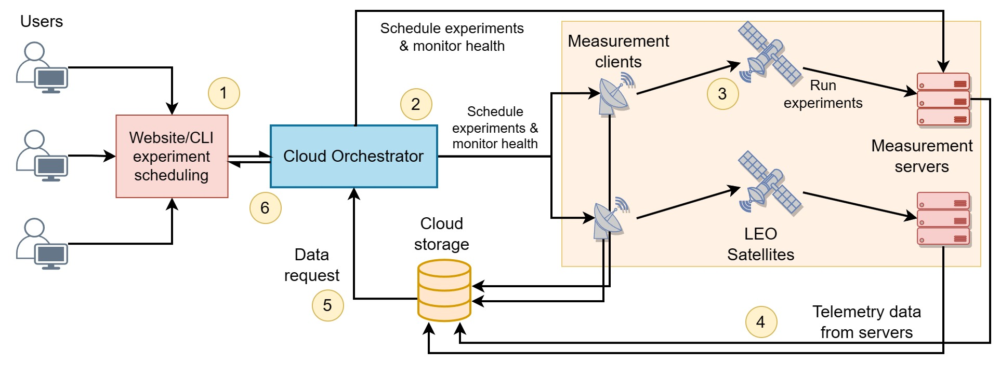

# LEOScope (LEO broadband testbed): cloud-orchestrator and measurement client/server stubs
*This repository is part of an organization that is governed by multiple clauses. Details are [here](https://github.com/leoscope-testbed/.github)


LEOScope is a platform to enable experimentation and development across LEO satellite networks. The goal is to enable real-world experimentation with respect to satellite networks at a global scale.
The Web portal for interfacing with the cloud orchestrator is [here](https://github.com/leoscope-testbed/website)


<!--  Official Website: [LEOScope](https://20.168.9.14/) -->

## Architecture


<!--  -->

The testbed has 4 major components:
* `Measurement Nodes` : Measurement entities consist of Measurement Clients and Measurement Servers, they are the end nodes where the experiments are deployed.
* `Cloud Orchestrator` : Cloud Orchestrator or Orchestrator is responsible for handling the experiment schedule across nodes, updating the measurement nodes with the latest schedule and experiment information.
* `Website/CLI` : Website (not included in this repository) or CLI is used by the end user to schedule, monitor, update and delete experiments on LEOScope and to download the results/logs, once the experiments are completed.
* `Cloud Storage` : The experiment logs are uploaded on Cloud storage by the measurement nodes and the end-user is updated once the logs are available on Cloud Storage.

## Repository Structure

* `cli\` : Code related to handling of the CLI commands to perform tasks on LEOScope.
* `common\`: Defines the gRPC APIs used for communication between Orchestrator and measurement nodes, and the Orchestrator and the LEOScope website. Also contains helper functions common across the different components of the testbed such as AzureBlobStorage client, Trigger lexer, etc.
* `doc\`: Detailed documentation of the LEOScope Testbed in Sphinx format, available on: <!--  [Documentation](https://20.168.9.14/). -->
* `docker\`: Docker files for initializing the docker containers for orchestrator and node.
* `node\`: Handling of the experiment life-cycle at the measurement nodes. Life-cycle of an experiment includes: fetching experiments schedules from orchestrator, deploying the experiments, executing the experiments, uploading logs and deleting the experiment and logs once the experiments are over.
* `orchestrator\`: Handling gRPC requests from the LEOScope website and the measurement nodes, scheduling experiments and updating the status of the nodes and experiments.

## Getting Started 

*<sup><sub>Currently, only available on exclusive request from the developers/maintainers.</sub></sup>

### Adding your experiments to LEOScope
#### 1. Pushing experiment images to dockerhub

user: `<dockerhub_username>`, access token: `<dockerhub_access_token>` 
(Access token is currently available on request from the developers/maintainers of LEOScope).

1. `$ docker login -u projectleopard`
2. `$ sudo docker tag leotest:latest projectleopard/leotest:latest`
3. `$ sudo docker push projectleopard/leotest:latest`

#### 2. Scheduling experiments on LEOScope website or CLI
##### LEOScope Website
Go to <Website_URL>, login and schedule the experiments. (Experiment scheduling is currently available only after manual approvals from the developers/maintainers of LEOScope).

**OR**

##### Setup CLI
1. Go to https://repo.anaconda.com/archive/ and copy the link for the latest release (select the correct release for your platform)
`$ curl --output anaconda.sh <link>`
example: `$ curl --output anaconda.sh https://repo.anaconda.com/archive/Anaconda3-5.3.1-Linux-x86_64.sh`
 2.  `$ bash anaconda.sh` and follow the installation instructions
 3. reload bash: `$ source ~/.bashrc`
 4. check installation: `$ conda --version`
 5. `$ pip install pyyaml azure-storage-blob pyroute2 grpcio pymongo protobuf \
        docker python-crontab tenacity croniter pymemcache paho-mqtt redis python-atd`

Now the CLI setup is complete and you can start running the CLI commands.

Example: To schedule an experiment on LEOScope
        ```python3 -m cli --userid=<user-id> --access-token='<access-token>' --grpc-host=<orchestrator-ip-address> job --action=schedule --nodeid=t<experiment-node-name> --jobid=<leoscope-job-id> --global-config="global_config.json" --exp-config="experiment-config.yaml" --schedule="<crontab>" --start-date='<start-date>' --end-date='<start-date>' --length=<experiment-duration>```

### Adding your Nodes to LEOScope

#### Preparing your Node for LEOScope

* Run `bash setup-leoscope-node.sh`

<!-- ##### Install docker-compose
1. Go to https://github.com/docker/compose/releases/ and select and copy the link for the correct release according to your system.
Then execute: `$ sudo curl -L "<link>" -o /usr/local/bin/docker-compose`
 example: `$ sudo curl -L "https://github.com/docker/compose/releases/download/v2.12.2/docker-compose-linux-x86_64" -o /usr/local/bin/docker-compose`
2.  `$ sudo chmod +x /usr/local/bin/docker-compose`
3. Check installation: `$ docker-compose --version` -->

#### Setup and start Orchestrator
0.1 Incase of Enviroment Issues with docker try `sudo apt-get install docker-ce docker-ce-cli containerd.io docker-buildx-plugin docker-compose-plugin` 
<br/> 
0.2 Incase you get global_config error Run `bash generate_grpc_stub.sh` and then `sudo python3 -m cli config --action=update --path=global_config.json`

1. Modify `docker-compose-orchestrator.yaml`. (with correct IP, access_token and any modification in desired ports)
2. Build Docker-Compose `docker-compose -f docker-compose-orchestrator.yaml build`
3. Launch Docker-Compose `docker-compose -f docker-compose-orchestrator.yaml up -d`

#### Register Node with Orchestrator

1. Register the node with the orchestrator using the website or cli from a username and its access_token. For first node, use the admin credentials you would have set-up. For example : `sudo python3 -m cli node --action=register --nodeid=test-node2 --name=test-node2 --location=london --coords=80,90` This will return a success message with access_token unique for the node. Save this carefully as this needs to be updated later in the docker-compose-node.yaml file.

#### Setup and start Measurement Nodes
1. Modify `executor-config.yaml`.
2. Modify `docker-compose-node.yaml` by updating correct name, IP (cloud orchestrator) and access token that you got by registering the node with the orchestrator.
3. Build Docker-Compose `docker-compose -f docker-compose-node.yaml build`
4. Launch Docker-Compose `docker-compose -f docker-compose-node.yaml up -d`
5. This should succesfully connect your node to the orchestrator.

#### Certificates
The certs folder needs to be updated with authenticated certificates which can be generated using a trusted authority or be self signed for non-production purposes. For eg : `openssl req -x509 -newkey rsa:4096 -keyout key.pem -out cert.pem -sha256 -days 365`

## Disclaimer 
A deployed testbed with this version of the code collects information like IP address, geolocation, and satellite terminal generated telemetry data from the measurement client nodes. Please use the code responsibly with proper EULA terms and ensure you have performed your own security and privacy measures. We are still working on a feature which will allow users to choose to let the orchestrator collect satellite terminal generated telemetry data from the measurement clients.
## How to contribute

The testbed code is stable but work-in-progress still, with new features to come up in the future. Open-source contributions are welcome. Please get in touch with the maintainers specified in MAINTAINERS.md to contribute to this repository.

## Initial Developers.

Below we list the initial developers of the testbed. Maintainer names are omitted for brevity.

| **NAME**           | **Email ID** |
|--------------------|--------------|
| Shubham Tiwari     |shubhamtiwaribits@gmail.com               |
|                    | tshubham@cs.washington.edu
| Aryan Taneja       |t-arytaneja@microsoft.com             |
| Saksham Bhushan    |t-sbhushan@microsoft.com             |
| Vinod Khandkar     |v.khandkar@surrey.ac.uk             |
| Abdullahi Abubakar |a.abubakar@surrey.ac.uk             |
| Roger Zhang        |yz02055@surrey.ac.uk             |
| Saeed Fadaei       |s.fadaei@surrey.ac.uk
