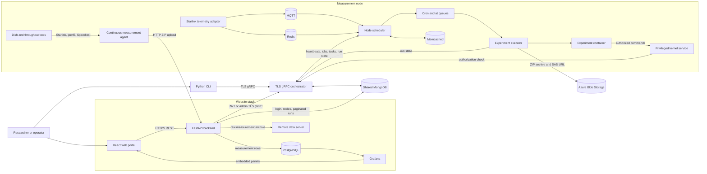

# LEOScope global testbed

LEOScope is a distributed platform for scheduling and running repeatable network experiments on geographically distributed LEO-satellite measurement nodes. This repository contains the cloud orchestrator, the node control plane, the experiment executor, the command-line client, shared gRPC contracts, and the supporting node services.

The user-facing web application is maintained in the separate [LEOScope website redesign repository](https://github.com/leoscope-testbed/website-backup). It is deployed beside this repository and shares the orchestrator network and data stores. Its role is documented here because it is the primary researcher interface and the receiver for continuous node measurements. In this repository, `dashboard/` is the node-side measurement agent that feeds the website; it is not the browser application.

## System overview

At system level, LEOScope separates the control plane from experiment execution:

- The **orchestrator** is the source of truth for users, nodes, job schedules, run status, and internal tasks.
- **MongoDB** persists the orchestrator's state.
- The **React website** gives researchers workflows for access requests, login, node discovery and management, experiment scheduling, run inspection, artifact links, and telemetry dashboards.
- The website's **FastAPI backend** acts as a browser-facing API gateway: it issues JWTs, translates REST requests into orchestrator gRPC calls, handles signup and email workflows, and ingests continuous node measurements.
- A **measurement node** periodically pulls its assigned jobs and tasks from the orchestrator, translates them into local cron or `at` entries, and starts an executor at the requested time.
- The **executor** pulls the requested experiment image, runs it as an isolated Docker container, records terminal telemetry and logs, uploads the resulting archive to Azure Blob Storage, and reports the run lifecycle to the orchestrator.
- **MQTT, Redis, and Memcached** support node-local telemetry, trigger evaluation, task deduplication, and executor coordination.
- The optional **kernel service** gives authorized experiments an authorization-gated path to inspect or change host networking parameters.
- The node-side **dashboard agent** continuously gathers Starlink, iperf3, and Ookla Speedtest data and uploads it to a web endpoint. This is a separate data path from scheduled experiment artifacts.


```mermaid
flowchart LR
    User[Researcher or operator] --> SPA[React web portal]
    User --> CLI[Python CLI]

    subgraph Website[Website stack]
        SPA -->|HTTPS REST| BFF[FastAPI backend]
        BFF -->|measurement rows| PG[(PostgreSQL)]
        PG --> Grafana[Grafana]
        Grafana -->|embedded panels| SPA
        BFF -->|raw measurement archive| Archive[Remote data server]
    end

    CLI -->|TLS gRPC| API[TLS gRPC orchestrator]
    BFF -->|JWT or admin TLS gRPC| API
    BFF <-->|login, nodes, paginated runs| DB[(Shared MongoDB)]
    API <--> DB

    subgraph Node[Measurement node]
        Scheduler[Node scheduler]
        Cron[Cron and at queues]
        Executor[Experiment executor]
        Workload[Experiment container]
        Kernel[Privileged kernel service]
        Telemetry[Starlink telemetry adapter]
        MQTT[(MQTT)]
        Redis[(Redis)]
        Cache[(Memcached)]
        Sources[Dish and throughput tools]
        Dashboard[Continuous measurement agent]

        Scheduler --> Cron --> Executor --> Workload
        Telemetry --> MQTT --> Scheduler
        Telemetry --> Redis --> Scheduler
        Scheduler <--> Cache
        Workload -->|authorized commands| Kernel
        Sources -->|Starlink, iperf3, Speedtest| Dashboard
    end

    API <-->|heartbeats, jobs, tasks, run state| Scheduler
    Executor -->|run state| API
    Kernel -->|authorization check| API
    Executor -->|ZIP archive and SAS URL| Blob[(Azure Blob Storage)]
    Dashboard -->|HTTP ZIP upload| BFF
```

The original architecture illustration is also available at [`extras/leoscope_arch.jpg`](extras/leoscope_arch.jpg).

## End-to-end experiment lifecycle

1. A researcher submits a job through the website or CLI. In the website, the React scheduling wizard builds the experiment YAML, schedule, trigger, node selection, and optional server selection, then sends them to FastAPI over REST.
2. FastAPI accepts the website bearer token and forwards it with the job to the orchestrator over TLS gRPC. CLI users call the same orchestrator API directly. A job identifies the target node, owner, Docker experiment configuration, time window, duration, and optional server node or trigger expression.
3. The orchestrator validates the forwarded JWT or CLI credentials, verifies that the target nodes exist and allow scheduling, validates the trigger syntax, and checks resource conflicts for overhead experiments.
4. The orchestrator stores the job in MongoDB. Jobs are either recurring `CRON` jobs or one-shot `ATQ` jobs.
5. Each node sends a heartbeat, updates its public IP, and polls the orchestrator. It reconciles remote jobs into its local crontab and `at` queue.
6. At the scheduled time, the node launches `node.executor`. The executor creates a run ID, fetches the experiment configuration, prepares the artifact directory, optionally starts a paired server on another node, and pulls the experiment image.
7. The experiment container runs on the configured Docker network with a writable artifact volume and LEOScope metadata in environment variables and Docker labels.
8. During execution, the executor reports run status and records Starlink terminal data alongside experiment output.
9. On completion, timeout, or termination, the executor stops the container, removes temporary routing, stops a paired server if used, archives the run directory, uploads it to Azure Blob Storage, obtains a read-only SAS URL, and marks the run complete.
10. The website displays experiments and paginated runs from orchestrator state, exposes the SAS artifact link, and computes user profile analytics. CLI users can query the same run state directly.

## Core concepts

| Concept | Meaning |
| --- | --- |
| User | An authenticated human, website service, or node identity. Roles include `ADMIN`, `USER`, `NODE`, `USER_PRIV`, `NODE_PRIV`, and `NODE_OWNER`. |
| Node | A registered measurement host with location, coordinates, owner, provider, heartbeat state, scheduling state, and optional bandwidth metadata. |
| Job | A persistent experiment definition and schedule. A job may produce multiple runs. |
| Run | One execution of a job, with timestamps, status, status message, and artifact URL. |
| Task | A short-lived internal command, currently used to start or stop a server container on a second node. |
| Overhead job | A resource-consuming job that participates in conflict checks and can be interrupted by scavenger mode. |
| Scavenger mode | A node-owner control that stops running overhead experiments. One-shot jobs are moved to the nearest available future slot when possible. |

## Component details

### Web portal and browser API

Repository: [LEOScope website redesign](https://github.com/leoscope-testbed/website-backup)

The website is the human-facing layer over the testbed. It is a separate application, but it is not a separate source of scheduling truth: control operations ultimately go to the orchestrator. The redesign stack contains a React single-page application, a FastAPI backend, PostgreSQL for continuous measurements, and Grafana for visualization.

#### React frontend

The React application provides public information pages and authenticated research workflows. Its main views are:

| View | Role |
| --- | --- |
| Access request and signup | Captures institutional identity, EULA acceptance, signature, and a one-time signup token. |
| Login and profile | Stores the issued access/refresh tokens in browser local storage and presents identity and experiment analytics. |
| Schedule experiment | A five-step wizard for node selection, one-shot or recurring schedules, Docker configuration, Azure settings, tests, triggers, and final review. |
| Schedule calendar | Shows busy intervals returned by the orchestrator so users can choose an available slot. |
| Experiments and runs | Lists user-owned jobs, deletes selected jobs, searches and paginates runs, shows run details, and links to uploaded artifacts. |
| Nodes | Lists public/schedulable nodes and lets authorized contributors register nodes. |
| Node management | Lets admins and node owners inspect availability, scheduled work, execution counts, and update scheduling, scavenger, and bandwidth metadata. |
| Dashboard | Maps nodes and embeds Grafana latency, upload, and download panels with shareable node/time-range URLs and data-export controls. |

The scheduling wizard can discover approved images and tags from Docker Hub or load backend-managed YAML definitions. It generates the experiment YAML expected by `node.executor`, including Docker, Azure `cloud_config`, optional weather, test, and artifact sections. Its trigger builder uses the same metric vocabulary as `common/trigger.py`.

The frontend maintains convenience authentication state, but authorization is enforced by the FastAPI endpoints and the orchestrator rather than by React routing alone.

#### FastAPI backend

Entry points in the website repository: `fast_backend/main.py`, `fast_backend/cloud_orch.py`

FastAPI acts as a backend-for-frontend and protocol adapter. It:

- authenticates email/password logins against users stored in the shared MongoDB and issues JWT access and refresh tokens;
- forwards each user's JWT to the orchestrator for experiment, calendar, node, and run operations;
- uses a configured orchestrator admin identity for access-request and account-activation operations;
- converts React request models and form data into gRPC/protobuf requests and converts responses back into UI-oriented JSON;
- reads MongoDB directly for login, public dashboard nodes, run pagination/search, and profile analytics;
- discovers configured Docker Hub repositories and produces normalized experiment templates without exposing registry credentials to the browser;
- receives continuous measurement ZIP files from node agents, parses their contents, and forwards the original archive to a remote data server.

The main browser API groups are:

| REST endpoints | Purpose |
| --- | --- |
| `/api/access-request`, `/api/registration-invite/*`, `/api/signup`, `/api/login`, `/api/refresh` | Access, EULA, invitation, account activation, and authentication. |
| `/api/dockerhub/images/`, `/api/experiments/`, `/api/delete-experiments/`, `/api/fetch-calendar-events/` | Experiment discovery, scheduling, deletion, and calendar availability. |
| `/api/nodes/`, `/api/get-nodes`, `/api/node-management/*` | Node registration, schedulable-node discovery, owner controls, and operational summaries. |
| `/api/get-my-experiments`, `/api/get-my-experiment-runs`, `/api/get-specific-experiment-run/` | User job/run views, server-side pagination, search, and artifact links. |
| `/api/profile`, `/api/profile/experiment-analytics` | Profile details and user-scoped experiment/run aggregates. |
| `/api/get-nodes-dash`, `/api/upload` | Public map metadata and node measurement ingestion. |

The website JWT secret and algorithm must match the orchestrator's JWT verification settings. The backend image also contains the shared gRPC client, generated protobuf modules, and trusted orchestrator certificate from this repository.

#### Access and account lifecycle

1. A prospective user submits an institutional email, requested role, EULA acceptance, and signature.
2. FastAPI creates a signed EULA PDF, hashes a random one-time signup token, and uses its admin gRPC client to persist the pending request in the orchestrator's `users` collection.
3. The backend emails the signed PDF and expiring signup link and records email delivery status through gRPC.
4. The signup page validates the token and pre-fills its non-sensitive invitation details.
5. FastAPI hashes the chosen password with bcrypt and asks the orchestrator to activate the pending user and invalidate the token.
6. Login verifies that hash against the shared user document and issues a JWT containing the user ID. When that JWT is forwarded over gRPC, the orchestrator resolves the current role from MongoDB before authorizing the request.

Direct signup can be enabled by configuration, but the redesign defaults to the signed access-request and one-time-invite flow.

#### Continuous measurement and visualization pipeline

This pipeline is independent of scheduled experiment artifacts:

1. The node-side `dashboard/` agent uploads ZIP files to the website's `/api/upload` endpoint.
2. FastAPI accepts ZIP files up to 10 MB, extracts the first `.txt` member, and passes it to `IperfGrpcDataParser`.
3. The parser recognizes Starlink gRPC CSV and iperf uplink/downlink formats and inserts time-series rows into PostgreSQL tables keyed by node and measurement time.
4. The backend forwards the original ZIP to the configured remote data server and deletes its temporary files after success.
5. A migration/helper script copies node names and coordinates from the orchestrator's MongoDB into the PostgreSQL `nodes` table.
6. Grafana reads PostgreSQL through its provisioned datasource. The React dashboard embeds the Grafana panels and supplies selected node IDs and time ranges as dashboard variables.
7. Dashboard export buttons query the remote data server directly for the selected tables, nodes, and date range.

The website therefore works with four storage roles:

| Store | Website use |
| --- | --- |
| Shared MongoDB | Identities, node/job/run state, login, paginated run queries, and public node status. |
| PostgreSQL | Parsed continuous gRPC and iperf time series plus dashboard node IDs/coordinates. |
| Azure Blob Storage | Scheduled experiment ZIP archives and SAS artifact links, written by `node.executor`. |
| Remote data server | Raw continuous-measurement ZIP retention and dashboard data exports. |

### Cloud orchestrator

Entry points: `orchestrator/__main__.py`, `orchestrator/orchestrator.py`

The orchestrator exposes the `LeotestOrchestrator` gRPC service defined in `common/leotest.proto`. It is a threaded TLS server and is responsible for:

- authenticating static access tokens or website-issued JWTs;
- applying role- and ownership-based authorization;
- managing users and the website access-request/signup workflow;
- registering nodes and issuing deterministic node access tokens;
- receiving heartbeats and maintaining node availability history;
- accepting, validating, querying, rescheduling, and deleting jobs;
- rejecting conflicts between overlapping overhead jobs on client and server nodes;
- recording run state and exposing scheduled events for calendar views;
- coordinating cross-node server start/stop tasks;
- storing global Azure Blob Storage and weather-service configuration;
- authorizing access to the privileged kernel service.

The server uses TLS only. It reads `certs/server.key` and `certs/server.crt`, listens internally on port `50051`, and expects callers to send one of these metadata combinations:

- `x-leotest-userid` plus `x-leotest-access-token`; or
- `x-leotest-jwt-access-token`.

### MongoDB datastore

Implementation: `orchestrator/datastore.py`

MongoDB holds six logical collections:

| Collection | Contents |
| --- | --- |
| `config` | Global blob-storage and weather configuration. |
| `users` | Active identities, roles, access tokens, and pending website registration records. |
| `nodes` | Node metadata, owner, scheduling switch, last heartbeat, availability history, and scavenger state. |
| `jobs` | Cron or one-shot experiment definitions. A TTL index removes jobs after `end_date`. |
| `runs` | Per-execution state, timestamps, messages, and blob URLs. |
| `tasks` | Temporary cross-node server commands. A TTL index removes expired tasks. |

The datastore creates indexes for common run, node, ownership, signup-token, and registration-status queries. On startup it recreates the built-in `admin` identity using the configured admin token.

### Measurement-node scheduler

Entry points: `node/__main__.py`, `node/scheduler.py`

The scheduler is the long-running node control loop. It starts local cron and `atd`, then repeatedly:

- sends a heartbeat and public-IP update;
- fetches all jobs in which the node is either the client or server;
- rewrites the local crontab for recurring jobs;
- rebuilds the local `at` queue for one-shot jobs;
- writes a JSON copy of each experiment configuration under `experiment_configs/`;
- fetches internal server tasks and deduplicates them through Memcached;
- synchronizes active trigger definitions into Redis;
- checks scavenger mode and stops active overhead containers when required.

Each reconciliation pass runs in a child process with a 60-second ceiling so that a blocked gRPC call cannot permanently stall the node loop. Long-lived job polling retries transient gRPC failures indefinitely; ordinary client requests use bounded retries.

### Experiment executor

Implementation: `node/executor.py`

The executor owns one run from deployment through cleanup. Its Docker implementation:

1. creates the run workspace and executor logs;
2. loads global configuration, job configuration, and `executor-config.yaml`;
3. checks scavenger mode and optionally reschedules an `ATQ` job;
4. starts Starlink terminal CSV collection;
5. optionally requests a server container on another node;
6. applies a configured host route;
7. pulls and launches the experiment image;
8. enforces the experiment duration or server-task TTL;
9. stops and removes the container and route;
10. ZIPs and uploads artifacts, publishes the SAS URL, and removes local run data.

Experiment containers receive these environment variables:

| Variable | Purpose |
| --- | --- |
| `LEOTEST_SERVER` | `1` for a paired server task, otherwise `0`. |
| `LEOTEST_JOBID` | Stable job identifier. |
| `LEOTEST_NODEID` | Node on which this container is running. |
| `LEOTEST_SERVERIP` | Public IP of the paired server, or `None`. |
| `LEOTEST_SERVER_NODEID` | Paired server node ID, or `None`. |

The container is also labeled with run, job, user, schedule, type, overhead, and server metadata. These labels let the scheduler find and stop LEOScope workloads without touching unrelated containers.

Artifacts follow this logical hierarchy:

```text
<artifactPath>/<nodeid>/<jobid>/<year>/<month>/<day>/<runid>.zip
```

The archive includes experiment-produced files, executor stdout/stderr, copied configuration, experiment arguments, and `grpc.csv` terminal telemetry.

### Cross-node client/server tasks

Some experiments need a receiver on another LEOScope node. When a job names `server`:

- the client executor creates a `SERVER_START` task in the orchestrator;
- the server node sees the task during polling and launches an executor in server mode;
- the server executor reports `TASK_COMPLETE` after its container starts;
- the client waits for that state before starting its own workload;
- after the client finishes, it creates a `SERVER_STOP` task;
- the server node finds and stops the matching labeled container.

Server tasks reuse the client run ID, add a `_server` suffix to server-side run metadata, and have a TTL tied to the experiment length.

### Trigger and telemetry subsystem

Implementations: `common/trigger.py`, `node/trigger.py`

The trigger subsystem combines several node-local data sources:

- Starlink dish status from MQTT;
- predicted satellite-distance statistics from TLE data and Skyfield;
- current weather from the configured weather API;
- optional aggregate network rates from running experiment containers (the monitor exists but is not started by the current scheduler).

The expression parser supports arithmetic, comparison, boolean operations, parentheses, absolute values, the current field value, five historical values (`field_1` through `field_5`), and a rolling average (`field_avg`). The orchestrator validates syntax before accepting a job. On the node, each telemetry update reevaluates active expressions and publishes the result to `leotest/triggers/<jobid>` over MQTT.

Current implementation boundary: trigger results are published, but the cron/`at` scheduler and executor do not yet consume them to delay or gate container launch. The monitoring and expression-evaluation path is present; trigger-controlled execution still needs to be wired in.

### Starlink telemetry adapter

Implementation: `docker/starlink-grpc-tools/check_grpc.py`

This service probes the terminal API at `192.168.100.1:9200`. If a terminal is found, it stores the terminal ID and availability flag in Redis and starts the upstream `starlink-grpc-tools` MQTT exporter. Dish fields are published under `starlink/dish_status/<terminal-id>/...`. If no terminal is present, the scheduler skips the dish gRPC monitor but continues operating.

### Node-local infrastructure services

Defined in `docker-compose-node.yaml`:

| Service | Role |
| --- | --- |
| `redis` | Terminal discovery state and active trigger definitions. |
| `mqtt` | Starlink telemetry and evaluated trigger results. |
| `memcached` | Executor-session markers and task deduplication. |
| `starlink-grpc-tools` | Adapter between the Starlink terminal API, Redis, and MQTT. |

These services are internal implementation details of a node and should normally remain on the private `leotest-net` bridge.

### Privileged kernel service

Entry point: `services/kernel/__main__.py`

The kernel service runs as a privileged container with `/sys` and the Docker socket mounted. It listens on TCP port `9000` inside the node network. For every connecting experiment container it:

1. maps the source IP to a Docker container;
2. reads that container's `userid` label;
3. asks the orchestrator whether that user has kernel privileges;
4. accepts or denies the command.

Supported operations currently include checking or changing the TCP congestion-control algorithm and writing BBR2 module parameters. Unrecognized input reaches a generic subprocess path, so this service must be treated as privileged remote execution. Only `USER_PRIV`, `NODE_PRIV`, and `ADMIN` experiment owners pass the authorization check.

### Continuous measurement agent (`dashboard/`)

Entry point: `dashboard/main.py`

This sidecar runs independently of scheduled jobs. It:

- continuously records Starlink terminal status and uploads hourly files;
- schedules hourly uplink and downlink iperf3 tests;
- schedules hourly Ookla Speedtest measurements when enabled;
- compresses each result and POSTs it to `UPLOAD_URL` with exponential-backoff retries;
- moves successful uploads into a local `uploaded/` directory;
- periodically removes old uncompressed `.txt` files.

Its primary settings are `CLIENT_NAME`, `UPLOAD_URL`, `IPERF_SERVER`, `IPERF_PORT`, `SPEEDTEST_ENABLED`, and `TZ`. In the integrated deployment, `UPLOAD_URL` points to the website's `/api/upload` endpoint. This HTTP flow feeds the PostgreSQL/Grafana dashboard pipeline and is separate from the executor's Azure artifact upload.

Current integration boundary: the node agent also produces Ookla Speedtest files, but the website parser currently recognizes only Starlink gRPC and iperf filenames. Speedtest uploads need a corresponding website parser before they can enter the dashboard data store.

### Shared protocol and library code

The `common/` package is used by the orchestrator, nodes, services, and CLI:

- `leotest.proto` is the source gRPC contract.
- `leotest_pb2.py` and `leotest_pb2_grpc.py` are generated Python bindings.
- `client.py` is the authenticated TLS gRPC client and retry wrapper.
- `job.py`, `node.py`, and `user.py` define domain objects and schedule-conflict logic.
- `trigger.py` defines the trigger language and evaluator.
- `azure.py` and `utils.py` provide blob-storage, archive, routing, telemetry, and external-service helpers.
- `sly/` is the bundled lexer/parser implementation used by the trigger language.

Regenerate the gRPC bindings after changing the protocol:

```bash
bash generate_grpc_stub.sh
```

### Command-line interface

Entry point: `cli/__main__.py`

Run the CLI as a Python module:

```bash
python3 -m cli \
  --grpc-host <orchestrator-host> \
  --grpc-port <orchestrator-port> \
  --userid <userid> \
  --access-token <token> \
  <service> <options>
```

Available service groups are:

| Group | Main actions |
| --- | --- |
| `config` | Get or update global configuration. |
| `user` | Register, query, modify, or delete users. |
| `node` | Register, query, update, delete, or change scavenger mode. |
| `job` | Schedule, query, or delete jobs. |
| `run` | Query runs, get scheduled calendar events, or download artifacts. |
| `services` | Verify access to the kernel service. |

Example one-shot job:

```bash
python3 -m cli \
  --grpc-host 127.0.0.1 \
  --grpc-port 50052 \
  --userid researcher \
  --access-token '<token>' \
  job --action schedule \
  --jobid latency-test-001 \
  --nodeid test-node \
  --type atq \
  --start-date '<ISO-8601-start>' \
  --end-date '<ISO-8601-end>' \
  --length 300 \
  --exp-config '<experiment-config.yaml>'
```

Dates are parsed by `python-dateutil`; use unambiguous ISO-8601 values and keep all hosts on synchronized UTC clocks.

## Configuration

| File or setting | Used by | Purpose |
| --- | --- | --- |
| `global_config.json` | Orchestrator, executor, CLI | Default blob connection, container, artifact prefix, and weather API key. Upload it through the `config` RPC. |
| Experiment YAML | Job and executor | Docker image/name, experiment-specific settings, and current experiment-specific `cloud_config` credentials. |
| `executor-config.yaml` | Executor | Docker network and host-to-container artifact volume mapping; optional route manipulation. |
| `ext_depen/ext_dependency.yaml` | Node monitors | Public-IP service, TLE source, local TLE shell file, weather URL, and monitoring coordinates. |
| `docker-compose-orchestrator.yaml` | Control plane | Orchestrator/Mongo profile, ports, database, admin token, and JWT settings. |
| `docker-compose-node.yaml` | Measurement node | Node identity, orchestrator endpoint, token, paths, networks, and node-side services. |
| `certs/server.crt`, `certs/server.key` | All gRPC components | TLS server certificate/private key and client trust root. |
| Website `.env` | React, FastAPI, PostgreSQL, Grafana | Shared JWT/orchestrator settings, Compose ports, database credentials, public URLs, Docker Hub, SMTP, and dashboard configuration. |
| Website `Dashboard_data/schema.sql` | PostgreSQL | Continuous gRPC/iperf tables, uniqueness constraints, and node relationships. |
| Website `grafana_data/` | Grafana | Provisioned PostgreSQL datasource and LEOScope dashboard definitions. |

The executor expects at least these experiment fields:

```yaml
cloud_config:
  connection_string: "<azure-blob-connection-string>"
  container: "<container-name>"

docker:
  image: "<registry>/<experiment-image>:<tag>"
  execute:
    name: "experiment"
```

The checked-in configuration values are templates and include placeholders. Do not commit production access tokens, JWT secrets, Azure connection strings, or private deployment certificates.

## Deployment outline

This branch is infrastructure-oriented and is not a zero-configuration installer. Before deployment, provide valid TLS material and credentials, review all host paths, and replace every placeholder in both Compose files.

The repository contains a certificate request and private key but does not contain `certs/server.crt`. For local development, create a matching self-signed certificate; use a trusted certificate and a protected private key in production:

```bash
openssl req -x509 -newkey rsa:4096 -nodes \
  -keyout certs/server.key \
  -out certs/server.crt \
  -sha256 -days 365 \
  -subj '/CN=localhost'
```

The Python client currently overrides the expected TLS name to `localhost`, so a differently named production certificate also requires updating the client TLS configuration.

### Orchestrator

The current Compose file exposes the redesign stack through the `redesign` profile. It also joins an external Docker network named `leoscopenet`.

```bash
docker network create leoscopenet
docker compose \
  --profile redesign \
  -f docker-compose-orchestrator.yaml \
  up --build -d
```

By default, the redesign profile maps host gRPC port `50052` to container port `50051` and MongoDB port `27018` to `27017`. Override these with the `LEOSCOPE_REDESIGN_*` environment variables declared in the Compose file.

Current branch note: `orchestrator/orchestrator.py` expects `LEOSCOPE_NODE_ADMIN_USERID` to exist in the orchestrator process environment. Inject it into the container, for example with a Compose `environment:` entry, and set it to the identity allowed to perform node-administration operations in addition to regular role/ownership checks.

After the orchestrator starts, upload the global configuration with admin credentials:

```bash
python3 -m cli \
  --grpc-host 127.0.0.1 \
  --grpc-port 50052 \
  --userid admin \
  --access-token '<admin-token>' \
  config --action update --path global_config.json
```

### Website

The website stack must join the same external `leoscopenet` network as `orchestrator_redesign` and `datastore_redesign`. Its backend reaches the orchestrator by gRPC service name and the shared MongoDB by datastore service name.

In the website repository:

1. Copy `.env.example` to `.env` and replace every `CHANGE_ME` value.
2. Set `LEOSCOPE_JWT_SECRET_KEY` and `LEOSCOPE_JWT_ALGORITHM` to the same values used by the orchestrator.
3. Set the orchestrator admin identity/token used for signup administration and configure MongoDB, PostgreSQL, public URLs, Docker Hub, SMTP, and remote-data-server settings.
4. Make the Compose build paths match the sibling website and orchestrator directory names in the deployment workspace.
5. Start React, FastAPI, PostgreSQL, and Grafana:

```bash
docker compose -f docker-compose.yml up --build -d
```

6. Load `Dashboard_data/schema.sql` into the dashboard PostgreSQL database and run `scripts/copy_mongo_nodes_to_dashboard.py` whenever node metadata must be synchronized into the dashboard's `nodes` table.

The example environment maps FastAPI to host port `8001`, React to `3001`, PostgreSQL to `5491`, and Grafana to `3004`. Production normally publishes React, `/api`, and `/grafana` behind a single TLS reverse proxy.

### Measurement node

1. Install Docker with Compose, cron, and `atd`. `setup-leoscope-node.sh` documents the original Ubuntu preparation flow; review it before running because it changes NIC, iptables, Docker, and package settings.
2. Register the node through the website or CLI and save the returned node access token.
3. Update `docker-compose-node.yaml` with the node ID, orchestrator endpoint, node token, dashboard endpoint, and host artifact path.
4. Make the Docker network name in `executor-config.yaml` and the kernel service match the actual Compose project network. Using `--project-name global-testbed` preserves the checked-in default `global-testbed_leotest-net` name.
5. Make the executor volume source match the node service's host artifact mount.
6. Start the node stack:

```bash
docker compose \
  --project-name global-testbed \
  -f docker-compose-node.yaml \
  up --build -d
```

The node mounts `/var/run/docker.sock` so the scheduler and executor can manage sibling experiment containers. The kernel service is additionally privileged and mounts `/sys`; deploy it only on hosts where that trust boundary is acceptable.

## Ports and external dependencies

| Port or endpoint | Purpose |
| --- | --- |
| `50051/tcp` | Orchestrator TLS gRPC inside its container. The redesign Compose default exposes it as `50052`. |
| `27017/tcp` | MongoDB inside its container. The redesign Compose default exposes it as `27018`. |
| `1883/tcp` | Node-local MQTT. |
| `9001/tcp` | Mosquitto WebSocket listener, when enabled by its configuration. |
| `9000/tcp` | Kernel service inside the node Docker network. |
| `2025/tcp` | Published by the dashboard Compose service and used as the configured iperf port. `dashboard/main.py` itself is an iperf client and does not bind this port. |
| `192.168.100.1:9200` | Starlink terminal gRPC API expected by the telemetry adapter. |
| `8000/tcp` | Website FastAPI container; `.env.example` maps it to host port `8001`. |
| `3000/tcp` | React development server; `.env.example` maps it to host port `3001`. |
| `5432/tcp` | Website dashboard PostgreSQL; `.env.example` maps it to host port `5491`. |
| `3000/tcp` | Grafana container; `.env.example` maps it to host port `3004`. |
| Azure Blob Storage | Scheduled experiment configuration and artifact storage. |
| Public-IP, weather, and TLE endpoints | Node identity and trigger-monitor inputs. |
| Website upload API, remote data server, and iperf server | Continuous dashboard ingestion, archive/export, and active measurement pipeline. |

## Repository map

```text
cli/                         Command-line interface
common/                      gRPC contract, generated stubs, client, models, utilities
config/mosquitto/            Node MQTT broker configuration
dashboard/                   Continuous Starlink/throughput measurement agent
docker/                      Container images for orchestrator, node, kernel, and telemetry
doc/                         Sphinx API documentation and generated output
ext_depen/                   External endpoint configuration and dependency checks
extras/                      Example experiment files and architecture image
node/                        Scheduler, trigger monitors, and experiment executor
orchestrator/                gRPC control plane and MongoDB datastore adapter
services/kernel/             Authorized privileged host-network service
scripts/                     Operational/migration helpers
certs/                       TLS and Mosquitto certificate/configuration material
docker-compose-orchestrator.yaml
docker-compose-node.yaml
executor-config.yaml
global_config.json
generate_grpc_stub.sh
setup-leoscope-node.sh
```

The separate website repository is organized as follows:

```text
fast_backend/                 FastAPI REST API, gRPC adapter, auth, ingestion
fast_backend/dockerhub_configs/
                              Approved/predefined experiment YAML metadata
frontend/                     React web portal and API client
Dashboard_data/schema.sql     PostgreSQL measurement schema
grafana_data/                 Provisioned datasource, dashboard, and Grafana config
scripts/                      MongoDB-to-PostgreSQL node synchronization helper
docker-compose.yml            React, FastAPI, PostgreSQL, and Grafana stack
.env.example                  Deployment contract for website services
```

## Current implementation boundaries

- The website is a separate repository and release unit, although it shares the orchestrator network, MongoDB data, JWT trust, and generated gRPC client code.
- `modify_job` exists in the protocol but is not implemented; replace a job by deleting and rescheduling it.
- Trigger expressions are monitored and published but do not currently control executor launch.
- Node `bandwidth_limits_json` is stored as metadata; this repository does not enforce it in the executor.
- Azure Blob Storage is the implemented scheduled-artifact backend.
- The executor and scheduler assume a Linux host with Docker, cron, `atd`, and access to the Docker socket.
- The website measurement ingester currently supports gRPC and iperf text files, not the Speedtest files also produced by the node agent.
- The website currently uses both orchestrator gRPC calls and direct reads of the shared MongoDB, so schema changes must remain compatible with both access paths.
- Dashboard cleanup currently targets `.txt` files; successfully uploaded `.zip` files need a separate retention policy.
- Several sample values, host paths, credentials, and certificate files require deployment-specific replacement.

## Security and privacy

LEOScope nodes can collect public IP addresses, geolocation, Starlink terminal telemetry, throughput measurements, experiment logs, and user-supplied artifacts. Operators are responsible for obtaining consent, publishing suitable terms, applying data-retention controls, and securing the deployment.

In particular:

- rotate all template credentials and secrets;
- use trusted TLS certificates in production;
- restrict MongoDB, MQTT, Redis, Memcached, and the Docker socket from public access;
- protect the website's orchestrator admin credential and keep its JWT settings synchronized with the orchestrator;
- restrict or authenticate `/api/upload`, which is currently a public ingestion endpoint, and validate archives before extraction;
- replace the website backend's wildcard CORS policy with the actual production origins;
- account for access and refresh tokens being stored in browser local storage when defining the frontend's XSS controls;
- restrict PostgreSQL and Grafana administrative access even when Grafana viewer dashboards are public;
- treat Azure SAS artifact URLs as credentials;
- review experiments before granting privileged roles;
- isolate the kernel service and keep its host exposure closed;
- pin and scan experiment images and third-party dependencies.

## Documentation, governance, and contributing

The `doc/` directory contains the Sphinx API reference. Build it with:

```bash
make -C doc html
```

Project governance is described in [`GOVERNANCE.md`](GOVERNANCE.md), contribution guidance in [`CONTRIBUTING.md`](CONTRIBUTING.md), and current maintainers in [`MAINTAINERS.md`](MAINTAINERS.md). The code is licensed under the terms in [`LICENSE.md`](LICENSE.md).

Initial development was contributed by Shubham Tiwari, Aryan Taneja, Saksham Bhushan, Vinod Khandkar, Abdullahi Abubakar, Roger Zhang, and Saeed Fadaei.
